# Tea 架构

**当前 Profile**：`simple-layered`

> Tea 是可控自动回复业务应用；Mud 保存公共会话数据，Stem 执行外部发送。

> 2026-09-30 对齐 Maia 新基线的 TS/Node.js/Fastify、TiDB/Drizzle 与 BullMQ；以下为目标设计，尚无本轮异步流程或观测验收结果。精确版本与公共约束继承 [Maia 架构](../ARCHITECTURE.md)。

## 1. 定位与边界

Tea 负责会话检索用例、候选消息过滤、ReplyPolicy 评估、上下文最小化、回复生成适配、人工审核及回执关联。它不摄取/拥有原始 Conversation/Message，不向终端直发命令，不把账号凭据或未授权消息发送给模型。

### Seed 依赖契约

Tea 按真实需求消费 Seed 已交付的 TS/npm 技术包，锁定版本与制品摘要；缺口通过当前 Story/Task 的 dependency 协作交付，不预建通用 MQ 包。ReplyPolicy/Candidate/Draft/Approval/Submission、业务幂等、Drizzle 模型/查询/迁移与队列 processor 留在 Tea。旧 wheel 和 Redis/OceanBase adapter 描述退出当前设计，不视为可用的新 TS 制品。

## 2. 模型与流程

Tea 是 ReplyPolicy、ReplyCandidate、ReplyDraft、Approval 和 ReplyOutcome 的唯一写入者；Mud 只拥有 Conversation/Message。ReplyOutcome 仅保存 Stem Task/Execution/Proof 引用、来源事件版本和消费水位，不复制或裁决执行最终状态。

Tea 是其私有聚合 AccessMetadata 的 PEP 和最终授权者：从本库读取真实 OwnerRef/Creator/User/version，经服务身份调用 Mud capability/effective-Own，再以 Seed `access-scope-kernel.v1` 合并。Message/Content 与 Stem 引用仍分别调用其所有者；Sage/Iris/模型不得传授权事实。依赖不可用或版本未知时 fail-closed，P0 不缓存授权决定。

ReplyPolicy 遵循 `draft→validated→published→deprecated→archived`，发布版本不可原地修改，固定 Account、意图、Content/生成器、已发布 Action/Workflow 和审批模式（自动执行/先审后发/仅建议）。

- Candidate：`discovered→filtered/eligible→drafted→closed`，CAS 版本阻止并发重复评估。
- Draft：`drafting→pending_approval→approved/rejected/expired/superseded→submitted`；编辑产生新 version 并 supersede 旧稿。
- ReplyApproval：`pending→approved/rejected/expired→consumed`，绑定 draft/策略/参数摘要、确认人和过期时间，单次消费。
- Submission：`prepared→calling→succeeded/failed/outcome_unknown`，终态命令按 idempotency key 返回原结果。

流程为：从 Mud 查询/消费消息 → 逐个校验关联实体 → 规则过滤 → 构造脱敏上下文 → 生成/模板草稿 → 策略分支/ReplyApproval → 提交 Stem Task Command → 关联只读回执。Task Command 固定 Action/Workflow 版本、输入/目标/权限候选；Stem 重验并生成权威快照与 Todo，Tea 不定义隐式发送操作或流程节点。ReplyApproval 只批准回复内容；若 Action 风险策略需要外部副作用确认，Tea 通过 Stem Confirmation API 创建并获得绑定同一目标/版本/参数的 `confirmation_id`，由 Stem 在入队事务单次消费，不能用 ReplyApproval 替代。

自动回复业务唯一键为 `(tenant_id, message_id, reply_purpose)`，独立于 policy version；策略升级/事件重放只能产生新的评估记录，若该 reply key 已 submitted/succeeded 则不得再次外发，人工明确创建的新回复使用新的 purpose/command ID。每次提交先持久化稳定 submission/idempotency key，超时后向 Stem 对账，不盲重试。策略版本、上下文摘要和 Resolver 来源随结果保存。

## 3. 契约与可靠性

Mud API/事件是会话事实来源；生成器经窄 Provider 接口注入；Stem API 是发送唯一入口；Iris/Sage 只调用 Tea 应用 API。消息延迟、重复、乱序均不得产生重复回复。模型失败可降级为人工草稿，但不得静默改用未审批内容。

### 3.1 业务模块

| 模块 | 核心对象 | 责任 |
|---|---|---|
| Inbox | MessageCursor、Candidate | 消息消费、业务去重、候选生命周期 |
| Policy Studio | ReplyPolicy、IntentRule、Scope、ApprovalMode | 规则预览、冲突优先级、版本发布 |
| Context | ContextBundle、Citation、Redaction | 授权取数、窗口裁剪、知识引用、脱敏 |
| Generation | GeneratorPort、PromptVersion、DraftVersion | 模板/模型生成、结构化校验、成本预算 |
| Review | ReplyApproval、ReviewQueue | 编辑/接受/拒绝/超时和责任归因 |
| Delivery | Submission、StemConfirmationRef | 发送幂等、对账、执行引用 |
| Outcome | ReplyOutcome projection | 原消息→策略→草稿→审核→Task/Proof 追溯 |

### 3.2 核心业务流程

```text
message event → candidate dedupe → policy match/conflict resolution
→ authorization + context bundle → template/model draft
→ content/safety validation → auto | review | suggestion branch
→ Stem confirmation when required → Task Command → outcome projection
```

规则冲突按显式 priority、specificity、published_at 决定并记录原因；没有唯一命中时转人工，不随机选择。ContextBundle 记录每条信息的 owner/source/version/permission decision，生成后源权限撤销时禁止提交旧草稿。

### 3.3 对外契约与非功能

- Policy API：draft/validate/sample-preview/publish/deprecate，不原地改 published。
- Review API：claim/edit/approve/reject，使用 draft version CAS，防两人同时审批。
- Query API：candidate/draft/outcome/cursor freshness；消息正文仍按 Mud 权限实时读取。
- 生成 Provider 强制超时、token/cost budget、供应商数据政策和内容安全；提示注入内容不能成为系统指令。
- 消息洪峰按 tenant/account 分区和配额；慢模型不阻塞消费水位，Candidate 持久队列可恢复。

路线：T0 检索/候选 → T1 规则与模板建议 → T2 人工审核发送 → T3 低风险自动发送 → T4 知识增强/质量评估 → T5 多渠道策略；每一步先证明无重复回复和可人工接管。

### 3.4 BullMQ 异步节点

对应 US-004/005/014/015，按 [Maia 异步方案](../docs/architecture/async-jobs.md) 分离快速接收与耗时生成：

```mermaid
flowchart LR
  M[Mud 消息变更 Job] --> IQ[tea-inbox Queue / Worker]
  IQ --> C[事务写 Candidate + 来源水位 + Outbox]
  C --> GQ[tea-generation Queue]
  GQ --> GW[授权取数 + 有界模型调用]
  GW --> D[版本化 Draft / 人工降级]
  D --> A[审批与有效性校验]
  A --> S[持久 Submission + Outbox]
  S --> SQ[tea-submission Queue / Worker]
  SQ --> ST[Stem Command / 未知结果对账]
  ST --> OQ[tea-outcome Queue / 投影 Worker]
```



| 工作 | 使用与边界 |
|---|---|
| 接收候选 | Inbox Worker 只做校验、业务去重与持久接手；下一阶段 Outbox 同事务提交，不等待模型响应，慢模型不阻塞消息水位 |
| 生成/重新评估 | I/O Worker 独立并发和供应商配额，固定 Candidate/策略/上下文版本及 deadline；可恢复错误有限退避，超时转人工。重复唤醒可用 deduplication；仅允许替换的同一候选重算可防抖，不能吞掉不同消息 |
| 审核过期/计划唤醒 | delay 或 Job Scheduler 仅唤醒状态检查；到期重验草稿版本、源权限、审批、取消和降级策略，不能从 Job 直接跳过审批发送 |
| 提交与结果投影 | 稳定 submission/idempotency key 由业务记录持有，Worker 调用 Stem；超时进入对账，后续 Job 先查询结果，不能生成新 key 重复提交。结果 Job 依来源版本更新投影 |
| 样本评估/批量预览 | 大批样本拆为有界 Job，CPU 计算使用 sandboxed processor；各样本结果持久化，评估不改变自动发送权限 |

业务幂等仍使用本章 reply key，Worker 重试不会创建第二次业务回复。QueueEvents 仅推送可补查的草稿/进度通知。观测按 [统一方案](../docs/architecture/async-jobs.md#62-opentelemetry-与三类观测信号) 关联消息、Candidate、Draft、Submission 和 Stem 引用；指标区分排队、模型调用、审核等待与回执等待，不导出上下文正文。验收验证慢模型隔离、重复/晚到生成、审批后权限撤销、提交超时对账及可关联的三类观测信号。

## 4. 技术边界与观测

服务采用 TS/Node.js/Fastify，私有 TiDB Schema 通过 Drizzle 管理，版本继承 Maia。观测覆盖候选积压、过滤原因、生成延迟、审核等待、提交/回执失败、敏感信息拦截和重复抑制；资源、进程、伸缩与制品配置只在 [部署设计](../docs/DEPLOYMENT.md) 维护。

## 5. 迁移

涉及既有策略/草稿/结果数据时，由对应迭代技术方案确认真实源数据并设计字段、权限、状态及队列在途工作的转换与验证；遵守 Harness 数据迁移规范。Conversation/Message 始终只留 Mud 引用，架构不预设迁移版本、执行脚本或旧 Python 方案。
